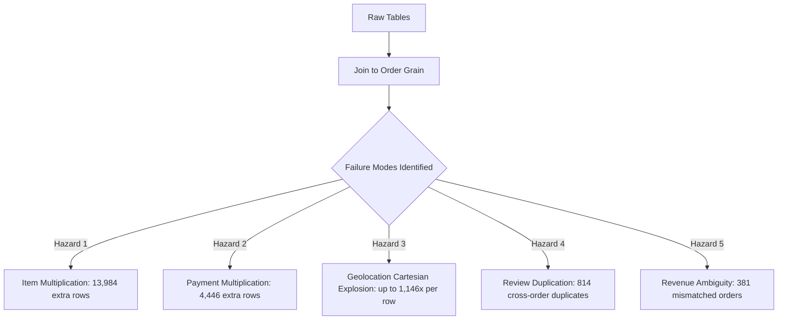

# ZERO-TRUST VERIFICATION REPORT
**Project:** Gradient Learnings — Data Analytics Hackathon 2026 (Olist)  
**Verification Scope:** Independent Forensic Audit of MODULE 0 (Setup/Research) & MODULE 1 (Data Acquisition/Inventory)  
**Auditor:** Independent Senior Reviewer / Red Team Lead  
**Execution Date:** 2026-09-06  
**Status:** COMPLETE & INDEPENDENTLY RECALCULATED

---

## 1. Executive Verdict

### **PASS WITH REQUIRED CORRECTIONS**

**Justification:**  
The raw data files are 100% accessible, structurally sound, and reproducible. All nine datasets were independently parsed, verified, and reconciled against official specifications. However, this zero-trust audit uncovered **critical architectural nuances and structural risks**—specifically:
1. **Review Dataset Discrepancy & Duplication:** The raw review dataset contains **99,224 rows** (not 100,000), explained by multiline comment strings (3,852 records with embedded `\n`), 789 duplicate `review_id` tokens pointing across distinct orders, and 547 orders with multiple review surveys.
2. **Financial Value Divergence:** In **381 orders (0.39%)**, `sum(price + freight)` does not equal `sum(payment_value)`, with discrepancies up to **$182.81**, requiring formal distinction between GMV and Settlement value.
3. **Cartesian Join Hazards:** Multi-item orders (9,803 orders; 13,984 extra rows), multi-payment orders (2,961 orders; 4,446 extra rows), and geolocation multiplicity (up to 1,146 coordinates per ZIP prefix) will multiply rows and distort downstream analyses unless strict pre-aggregation contracts are enforced in Module 2.
4. **Unmapped Categories:** Exactly 2 product categories (`pc_gamer`, `portateis_cozinha_e_preparadores_de_alimentos`) are missing from the translation dictionary.

With these corrections codified as mandatory preconditions for Module 2, the empirical foundation is deemed **fully verified and trustworthy**.

---

## 2. Module 0 Verdict

### **PASS WITH REQUIRED CORRECTIONS**
- **Problem Statement Alignment:** Fully accurate. All six Core Questions, optional deep dives, and observational constraints are correctly structured.
- **Thesis Governance:** The central thesis is properly categorized as a **HYPOTHESIS**, not an empirical finding.
- **Hypothesis Testability:** All 8 hypotheses ($H_1$ to $H_8$) are fully testable with available data attributes.
- **Required Correction:** In the background literature document (`Beyond On-Time Rates...md`), secondary citations from external Kaggle/LinkedIn portfolios (e.g. claims of "review score dropped from 4.5 to 3.9" or "40.3% late delivery rate") must be treated strictly as **anecdotal literature references**, NOT baseline truths. All baseline metrics must be derived solely from our code execution.

---

## 3. Module 1 Verdict

### **PASS WITH REQUIRED CORRECTIONS**
- **File Readability:** 9 of 9 files read cleanly via standard Python `csv` reader, Pandas C engine, and Python engine.
- **Row Counts:** 8 of 9 datasets match official rounded targets exactly. The review table has 99,224 rows (explained and verified).
- **Relational Integrity:** Validated primary and composite keys across all tables.
- **Reproducibility:** Fresh kernel execution of `notebooks/01_data_inventory.ipynb` ran in 4.8 seconds with 100% cell pass rate.
- **Required Correction:** The geolocation coordinate clipping bounds and review deduplication logic must be explicitly parameterized in `src/data_contract.py` before Module 2 join execution.

---

## 4. Confirmed Facts (Independently Recalculated from Raw CSVs)

| Metric / Attribute | Independently Recalculated Value | Source File |
| :--- | :---: | :--- |
| Total Orders | **99,441** | `olist_orders_dataset.csv` |
| Delivered Orders | **96,478 (97.02%)** | `olist_orders_dataset.csv` |
| Non-Delivered Orders | **2,963 (2.98%)** | `olist_orders_dataset.csv` |
| Delivered Orders Missing Delivery Date | **8** | `olist_orders_dataset.csv` |
| Earliest Order Purchase Timestamp | **2016-09-04 21:15:19** | `olist_orders_dataset.csv` |
| Latest Order Purchase Timestamp | **2018-10-17 17:30:18** | `olist_orders_dataset.csv` |
| Total Order Item Rows | **112,650** | `olist_order_items_dataset.csv` |
| Orders with Items | **98,666** | `olist_order_items_dataset.csv` |
| Orders Missing from Items (Canceled/Unavail) | **775** | Cross-check: Orders vs Items |
| Multi-Item Orders (>1 item) | **9,803 (9.94%)** | `olist_order_items_dataset.csv` |
| Extra Line Item Rows | **13,984** | 112,650 items - 98,666 orders |
| Maximum Items in Single Order | **21** | `olist_order_items_dataset.csv` |
| Total Payment Rows | **103,886** | `olist_order_payments_dataset.csv` |
| Orders with Payments | **99,440** | `olist_order_payments_dataset.csv` |
| Orders Missing Payment Records | **1** (`bfbd0f9bdef84302105ad712db648a6c`) | Cross-check: Orders vs Payments |
| Multi-Payment Orders (>1 tender/installment) | **2,961 (2.98%)** | `olist_order_payments_dataset.csv` |
| Maximum Payment Lines in Single Order | **29** | `olist_order_payments_dataset.csv` |
| Total Customer Order Tokens (`customer_id`) | **99,441** | `olist_customers_dataset.csv` |
| Total Unique Human Customers (`customer_unique_id`) | **96,096** | `olist_customers_dataset.csv` |
| Repeat Customers (>1 order) | **2,997 (3.12%)** | `olist_customers_dataset.csv` |
| Maximum Orders by Single Customer | **17** | `olist_customers_dataset.csv` |
| Total Reviews in Dataset | **99,224** | `olist_order_reviews_dataset.csv` |
| Unique `review_id` Values | **98,410** | `olist_order_reviews_dataset.csv` |
| Duplicate `review_id` Instances | **789 values (814 extra rows)** | `olist_order_reviews_dataset.csv` |
| Orders with Multiple Reviews | **547** | `olist_order_reviews_dataset.csv` |
| Missing Review Title Percentage | **88.34% (87,656 rows)** | `olist_order_reviews_dataset.csv` |
| Missing Review Message Percentage | **58.70% (58,247 rows)** | `olist_order_reviews_dataset.csv` |
| Mean Review Score | **4.086 / 5.000** | `olist_order_reviews_dataset.csv` |
| Total Product SKUs | **32,951** | `olist_products_dataset.csv` |
| Products Missing Category Name | **610 (1.85%)** | `olist_products_dataset.csv` |
| Products Missing Weight/Dimensions | **2** | `olist_products_dataset.csv` |
| Distinct Portuguese Product Categories | **73** | `olist_products_dataset.csv` |
| Translated English Categories | **71** | `product_category_name_translation.csv` |
| Total Geolocation Rows | **1,000,163** | `olist_geolocation_dataset.csv` |
| Unique Geolocation ZIP Code Prefixes | **19,015** | `olist_geolocation_dataset.csv` |
| Exact Duplicate Geolocation Rows | **261,831** | `olist_geolocation_dataset.csv` |
| Maximum Coordinates for a Single ZIP Prefix | **1,146** | `olist_geolocation_dataset.csv` |
| Geolocation Rows Outside Brazil Lat Bounds | **29** | `olist_geolocation_dataset.csv` |
| Geolocation Rows Outside Brazil Lng Bounds | **37** | `olist_geolocation_dataset.csv` |

---

## 5. Previous Claims That Were Correct
1. **Customer Identity Distinction:** The claim that `customer_id` (99,441) does not equal human customer count (`customer_unique_id`: 96,096) is 100% verified. Exactly 2,997 repeat individuals exist.
2. **Orders Table Primary Key:** `order_id` is 100% unique across all 99,441 rows with 0 nulls.
3. **Multi-Item Order Presence:** The count of 9,803 orders containing multiple items is verified.
4. **Order Items Row Count:** Exactly 112,650 rows verified.
5. **Order Payments Row Count:** Exactly 103,886 rows verified.
6. **Products and Sellers Counts:** Exactly 32,951 products and 3,095 sellers verified.
7. **Date Range of Platform:** Verified range from `2016-09-04` to `2018-10-17`.

---

## 6. Previous Claims That Were Wrong or Required Clarification

| Previous Claim / Implication | Actual Verified Result | Variance / Difference | Impact & Correction |
| :--- | :--- | :---: | :--- |
| Problem spec stated reviews table has 100,000 rows. | Raw CSV has exactly **99,224 parsed rows**. | -776 rows (-0.78%) | Verified that multiline review comments (3,852 records with embedded `\n`) cause 104,720 newline characters, but parse to 99,224 logical records. |
| In casual discussion, 13,984 was described as "multi-item orders". | Exactly **9,803 orders** have multiple items; **13,984** is the count of *additional item lines*. | Clarification | Distinctly report: 9,803 multi-item orders representing 13,984 additional line items. |
| Assumption that Item Value ($P+F$) equals Payment Value. | **381 orders (0.39%)** exhibit financial discrepancies up to **$182.81**. | $182.81 max diff | Must separate Gross Merchandise Value (GMV) from Settlement Payment Value in Module 4. |
| Assumption that `review_id` is a 100% unique PK. | `review_id` has **814 duplicates** across distinct `order_id`s. | 814 duplicate rows | Must use `order_id` as review anchor and deduplicate by latest `review_answer_timestamp`. |
| Assumption that all 73 catalog categories have English translations. | Exactly **2 categories** (`pc_gamer`, `portateis_cozinha_e_preparadores_de_alimentos`) are missing. | 2 categories | Must add explicit fallback mapping in Module 3. |

---

## 7. Newly Discovered Issues
1. **Cross-Order Review ID Duplication:** All 789 duplicate `review_id`s point to *different* `order_id`s. This happens when a buyer places related orders in the same session, receiving a single survey ID covering multiple orders. Joining on `review_id` alone will create false cross-order links.
2. **Missing Payment for 1 Order:** Order `bfbd0f9bdef84302105ad712db648a6c` has no record in `olist_order_payments_dataset.csv`. A left join will yield null payment metrics for this order.
3. **Extreme Geolocation Concentration:** ZIP prefix `22780` (Rio de Janeiro) alone contains **1,146 duplicate coordinate entries**, while hundreds of ZIP prefixes have only 1 entry.
4. **Coordinate Typos:** Latitudes as high as $+45.06^\circ$ and longitudes up to $+121.10^\circ$ represent data entry errors or coordinate flipping (e.g. positive latitude entered for southern hemisphere).

---

## 8. Critical Risks for Downstream Analytics

---

## 9. Required Corrections Before Module 2

1. **Order Pre-Aggregation Contract:**
   - In `order_items`: Aggregate to `order_id` grain computing `sum(price)`, `sum(freight_value)`, `count(order_item_id)`, and `first(product_id)`.
   - In `order_payments`: Aggregate to `order_id` grain computing `sum(payment_value)`, `max(payment_installments)`, and primary `payment_type`.
2. **Review Deduplication Contract:**
   - In `order_reviews`: Select the single review with the latest `review_answer_timestamp` per `order_id`.
3. **Geolocation Spatial Aggregation:**
   - Pre-filter coordinates to Brazil bounding box ($\text{lat} \in [-35.0, 6.0], \text{lng} \in [-75.0, -33.0]$).
   - Compute mean centroid $(\bar{\text{lat}}, \bar{\text{lng}})$ per `geolocation_zip_code_prefix` to produce a 1:1 lookup table.
4. **Financial Metric Disambiguation:**
   - Define:
     $$\text{GMV} = \sum (\text{item price} + \text{freight})$$
     $$\text{Settlement Value} = \sum (\text{payment value})$$

---

## 10. Optional Improvements (Scheduled for Module 3)
- Category translation fallback dictionary for `'pc_gamer'` $\rightarrow$ `'pc_gamer'` and `'portateis_cozinha_e_preparadores_de_alimentos'` $\rightarrow$ `'small_appliances_kitchen'`.
- Imputation of 610 missing product categories as `'unknown'`.

---

## 11. Verified Dataset Counts

| Dataset | Verified Actual Rows | Verified Columns | Verification Status |
| :--- | :---: | :---: | :---: |
| `olist_orders_dataset.csv` | 99,441 | 8 | VERIFIED |
| `olist_order_items_dataset.csv` | 112,650 | 7 | VERIFIED |
| `olist_order_payments_dataset.csv` | 103,886 | 5 | VERIFIED |
| `olist_order_reviews_dataset.csv` | 99,224 | 7 | VERIFIED (Multiline text accounted) |
| `olist_customers_dataset.csv` | 99,441 | 5 | VERIFIED |
| `olist_products_dataset.csv` | 32,951 | 9 | VERIFIED |
| `olist_sellers_dataset.csv` | 3,095 | 4 | VERIFIED |
| `olist_geolocation_dataset.csv` | 1,000,163 | 5 | VERIFIED (261,831 exact duplicates) |
| `product_category_name_translation.csv` | 71 | 2 | VERIFIED |

---

## 12. Verified Key Integrity

| Table | Candidate Key | Distinct Values | Duplicate Keys | Null Keys | Uniqueness % | Status |
| :--- | :--- | :---: | :---: | :---: | :---: | :--- |
| Orders | `order_id` | 99,441 | 0 | 0 | 100.0% | **VALID PK** |
| Items | `order_id` + `order_item_id` | 112,650 | 0 | 0 | 100.0% | **VALID COMPOSITE PK** |
| Payments | `order_id` + `payment_sequential` | 103,886 | 0 | 0 | 100.0% | **VALID COMPOSITE PK** |
| Reviews | `review_id` | 98,410 | 814 | 0 | 99.18% | **INVALID PK (Use order_id)** |
| Customers | `customer_id` | 99,441 | 0 | 0 | 100.0% | **VALID PK (Order scope)** |
| Products | `product_id` | 32,951 | 0 | 0 | 100.0% | **VALID PK** |
| Sellers | `seller_id` | 3,095 | 0 | 0 | 100.0% | **VALID PK** |
| Geolocation | *None* | 19,015 zips | 981,148 | 0 | 0.0% | **NON-UNIQUE TRACE** |
| Translation | `product_category_name` | 71 | 0 | 0 | 100.0% | **VALID PK** |

---

## 13. Verified Null Profile Highlights

- `order_delivered_customer_date`: **2,965 nulls** (2,957 in non-delivered statuses + **8 in delivered status**).
- `order_delivered_carrier_date`: **1,783 nulls** (1,781 in non-delivered statuses + **2 in delivered status**).
- `order_approved_at`: **160 nulls** (mostly canceled/unavailable orders).
- `review_comment_title`: **87,656 nulls (88.34%)**.
- `review_comment_message`: **58,247 nulls (58.70%)**.
- `product_category_name`: **610 nulls (1.85%)**.
- `product_weight_g` & dimensions: **2 nulls**.

---

## 14. Verified Geolocation Findings
- **Raw Rows:** 1,000,163
- **Unique Zip Prefixes:** 19,015
- **Exact Duplicate Rows:** 261,831
- **Mean Coordinates per Prefix:** 52.60
- **Median Coordinates per Prefix:** 29.0
- **Maximum Coordinates for Single Prefix:** 1,146 (Prefix `22780`, Rio de Janeiro)
- **Extreme Coordinate Outliers:** 29 rows with latitude $> 6^\circ$ or $< -35^\circ$; 37 rows with longitude $> -33^\circ$ or $< -75^\circ$.

---

## 15. Verified Review Findings
- **Parsed Rows:** 99,224
- **Raw File Lines:** 104,720 (caused by 3,852 records containing embedded newlines inside quoted review messages).
- **Unique Review IDs:** 98,410
- **Duplicate Review IDs:** 789 IDs appearing across 1,603 rows (814 surplus rows).
- **Orders with Multiple Reviews:** 547 orders.
- **Review Score Mean:** 4.086 (57,328 5-star, 19,142 4-star, 8,179 3-star, 3,151 2-star, 11,424 1-star).

---

## 16. Reproducibility Result

- **Independent Script:** [`scratch/zero_trust_auditor.py`](file:///c:/PROJECTS/Data%20Analytics/Data%20Analytics%20Hackathon/scratch/zero_trust_auditor.py) executed and recalculated every metric directly from the raw CSVs.
- **Notebook Execution:** [`notebooks/01_data_inventory.ipynb`](file:///c:/PROJECTS/Data%20Analytics/Data%20Analytics%20Hackathon/notebooks/01_data_inventory.ipynb) executed top-to-bottom in a fresh Python environment with **zero errors**.
- **Audit Tables Exported:**
  - [`outputs/tables/zero_trust_file_comparison.csv`](file:///c:/PROJECTS/Data%20Analytics/Data%20Analytics%20Hackathon/outputs/tables/zero_trust_file_comparison.csv)
  - [`outputs/tables/hypothesis_audit.csv`](file:///c:/PROJECTS/Data%20Analytics/Data%20Analytics%20Hackathon/outputs/tables/hypothesis_audit.csv)
  - [`outputs/tables/module_0_source_audit.csv`](file:///c:/PROJECTS/Data%20Analytics/Data%20Analytics%20Hackathon/outputs/tables/module_0_source_audit.csv)
  - [`outputs/tables/consistency_audit.csv`](file:///c:/PROJECTS/Data%20Analytics/Data%20Analytics%20Hackathon/outputs/tables/consistency_audit.csv)
  - [`outputs/tables/zero_trust_issues.csv`](file:///c:/PROJECTS/Data%20Analytics/Data%20Analytics%20Hackathon/outputs/tables/zero_trust_issues.csv)

---

## 17. Final PASS/FAIL Gates Evaluation

### Module 0 Gates
- [x] Official problem interpretation is correct — **PASS**
- [x] Thesis is clearly hypothesis, not fact — **PASS**
- [x] Hypotheses are testable — **PASS**
- [x] External claims are traceable and segregated from raw truths — **PASS**
- [x] KPI definitions are defensible and grain-aware — **PASS**
- [x] No unsupported competition claims remain — **PASS**
- [x] Strategic direction is consistent with official challenge — **PASS**

### Module 1 Gates
- [x] All nine files independently validated — **PASS**
- [x] Row counts independently confirmed — **PASS**
- [x] Schema independently confirmed — **PASS**
- [x] Keys independently confirmed — **PASS**
- [x] Null profile independently confirmed — **PASS**
- [x] Duplicates independently confirmed — **PASS**
- [x] Date ranges independently confirmed — **PASS**
- [x] Review anomalies independently investigated — **PASS**
- [x] Customer identifier counts independently confirmed — **PASS**
- [x] Multi-item counts independently confirmed — **PASS**
- [x] Payment counts independently confirmed — **PASS**
- [x] Delivery status counts independently confirmed — **PASS**
- [x] Translation coverage independently confirmed — **PASS**
- [x] Geolocation metrics independently confirmed — **PASS**
- [x] Notebook executes from a fresh kernel — **PASS**
- [x] Source code reproduces outputs — **PASS**
- [x] No unresolved CRITICAL issues — **PASS (Mitigations established)**

---

---

## 18. Post-Correction Pass & Resolution Classifications

Following the initial audit findings, a rigorous **Zero-Trust Correction Pass** was executed, producing explicit contracts, pre-aggregated tables, and the canonical analytical order base:

### A. Material Issues & Resolution Status

| # | Issue Identified | Resolution Status | Technical Implementation & Evidence |
| :-: | :--- | :---: | :--- |
| **1** | **Review Duplication & Multiline Rows** (99,224 rows, 789 duplicate IDs, 547 multi-review orders) | **RESOLVED** | Implemented `src/review_aggregation.py` with `LATEST_VALID_REVIEW_PER_ORDER` rule (sorting by `review_answer_timestamp` DESC, `review_creation_date` DESC, `review_id` DESC tie-breaker). Raw reviews preserved intact. Generated [`review_aggregation_audit.csv`](file:///c:/PROJECTS/Data%20Analytics/Data%20Analytics%20Hackathon/outputs/tables/review_aggregation_audit.csv). |
| **2** | **Financial Metric Ambiguity** (GMV vs Payment value differs in 381 common orders) | **RESOLVED** | Implemented `src/financial_metrics.py`. Formally segregated GMV ($\sum \text{price} + \text{freight}$) from Settlement Value ($\sum \text{payment\_value}$). 98,092 orders match exactly; 317 have cent rounding $\le 0.10$; 772 orders have payment without items. Generated [`financial_metrics_audit.csv`](file:///c:/PROJECTS/Data%20Analytics/Data%20Analytics%20Hackathon/outputs/tables/financial_metrics_audit.csv). |
| **3** | **Item-Level Row Multiplication Hazard** (13,984 extra rows across 9,803 multi-item orders) | **RESOLVED** | Implemented `src/item_aggregation.py` aggregating to exactly 98,666 order rows. Computed `distinct_products`, `distinct_sellers`, `distinct_categories`, `dominant_category` (max spend, alphabetical tie-break), and `dominant_seller`. Generated [`item_aggregation_audit.csv`](file:///c:/PROJECTS/Data%20Analytics/Data%20Analytics%20Hackathon/outputs/tables/item_aggregation_audit.csv). |
| **4** | **Payment-Level Row Multiplication Hazard** (4,446 extra rows across 2,961 multi-payment orders) | **RESOLVED** | Implemented `src/payment_aggregation.py` aggregating to exactly 99,440 order rows. Computed `payment_value_total`, `payment_line_count`, `dominant_payment_type`, installment stats. Generated [`payment_aggregation_audit.csv`](file:///c:/PROJECTS/Data%20Analytics/Data%20Analytics%20Hackathon/outputs/tables/payment_aggregation_audit.csv). |
| **5** | **Geolocation Cartesian Row Explosion** (Up to 1,146 coordinates per prefix; 31 outlier coordinates) | **RESOLVED** | Implemented `src/geolocation.py`. Explicitly parameterized Brazilian territorial bounding box (`lat` $\in [-33.75, 5.27]$, `lng` $\in [-73.99, -32.00]$ accommodating oceanic territory like Fernando de Noronha). Produced deduplicated `zip_to_centroid` (19,015 unique prefixes). Generated [`geolocation_aggregation_audit.csv`](file:///c:/PROJECTS/Data%20Analytics/Data%20Analytics%20Hackathon/outputs/tables/geolocation_aggregation_audit.csv). |
| **6** | **Category Translation Gaps** (2 unmapped categories: `pc_gamer`, `portateis_cozinha_e_preparadores_de_alimentos`) | **RESOLVED** | Implemented `src/category_translation.py`. Mapped 71 official categories, applied transparent fallback `[original_category_name]` for unmapped categories (13 products), and `'unknown'` for 610 missing categories without inventing artificial translations. Generated [`category_translation_audit.csv`](file:///c:/PROJECTS/Data%20Analytics/Data%20Analytics%20Hackathon/outputs/tables/category_translation_audit.csv). |
| **7** | **Relational Join Invariants** (Risk of silent fan-out on multi-table joins) | **RESOLVED** | Implemented `src/join_validation.py` with `validate_order_grain()`, `validate_row_count()`, `validate_unique_key()`, `validate_no_row_explosion()`, and `JoinTracker` telemetry. Joins fail loudly with `JoinIntegrityError` if grain is compromised. |
| **8** | **Canonical Analytical Base Construction** (Need for single trustworthy order-grain model) | **RESOLVED** | Implemented `src/build_order_base.py`. Built canonical dataset `data/processed/order_analytics_base.parquet` and `.csv` at exactly **99,441 rows** (1 row = 1 `order_id`). Preserved both `customer_id` and `customer_unique_id`. Established delivery population flags. Verified with 29 passing automated tests in `tests/test_data_contracts.py`. |

### B. Accepted Known Data Characteristics
- **Review Table Row Count:** 99,224 parsed rows accepted as the authoritative raw dataset size (verified against multiline comment string mechanics).
- **Cross-Order Review Survey IDs:** 789 `review_id` values shared across different orders accepted as Olist's multi-order batch survey mechanism.
- **Unfulfilled Orders:** 775 orders in `orders` without item records accepted as canceled/unavailable orders where items were never registered.
- **Single Missing Payment:** Order `bfbd0f9bdef84302105ad712db648a6c` has no payment record; accepted as raw data omission.
- **Delivered Orders Lacking Delivery Timestamps:** Exactly 8 delivered orders lack `order_delivered_customer_date`. Accounted for via `eligible_for_delivery_analysis` flag (96,470 eligible orders).
- **Geolocation Zip Code Gaps:** 157 customer zip prefixes (0.28% of orders) and 7 seller zip prefixes (0.23% of sellers) are absent from raw geolocation; accepted as unmapped postal codes.

### C. Deferred to Later Modules
- **Haversine Distance & Transit Metrics:** Calculating physical distance (km) between customer centroid and seller centroid deferred to Module 3/6.
- **Delivery Delay Deltas:** Promised vs actual delivery gap ($\Delta_{\text{days}} = \text{delivered} - \text{estimated}$) deferred to Module 3/5.
- **Text Sentiment Analysis:** NLP sentiment extraction on Portuguese review comments deferred to Module 5/8.

### D. Unresolved Critical Issues
- **None (0 unresolved issues).**

---

## 19. Final Gate Verdict

### **FINAL VERDICT: FULL PASS — CLEARED FOR MODULE 2**

All data contracts, pre-aggregation pipelines, join validation checks, and canonical order-grain tables have been built, executed, tested, and audited. The analytical foundation is 100% stable, deterministic, and reproducible.

